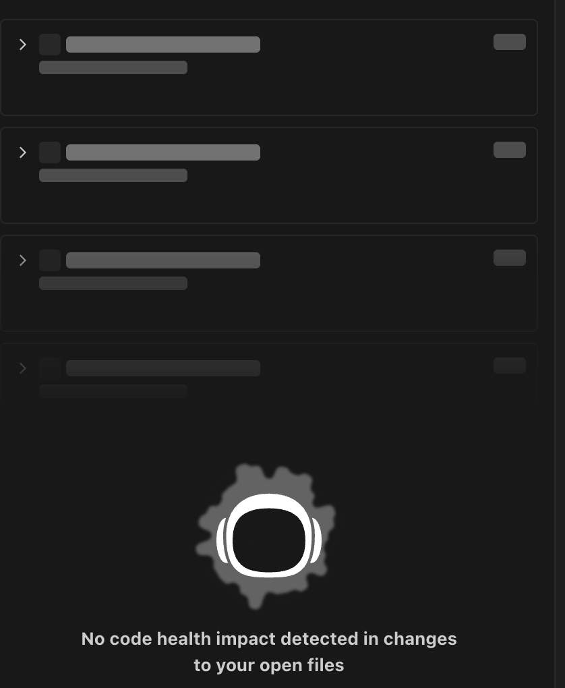
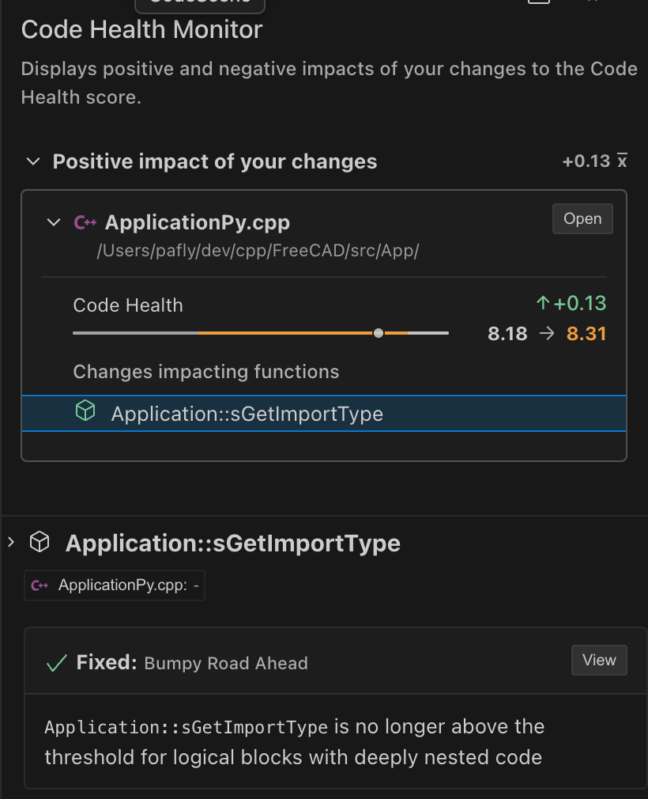
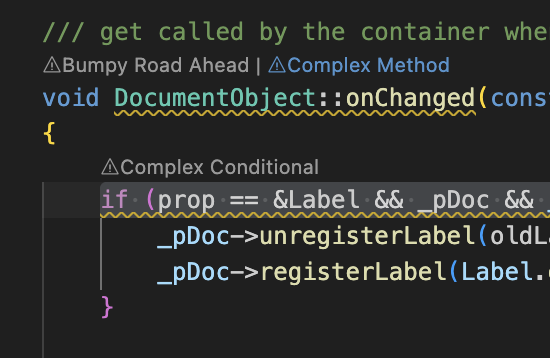
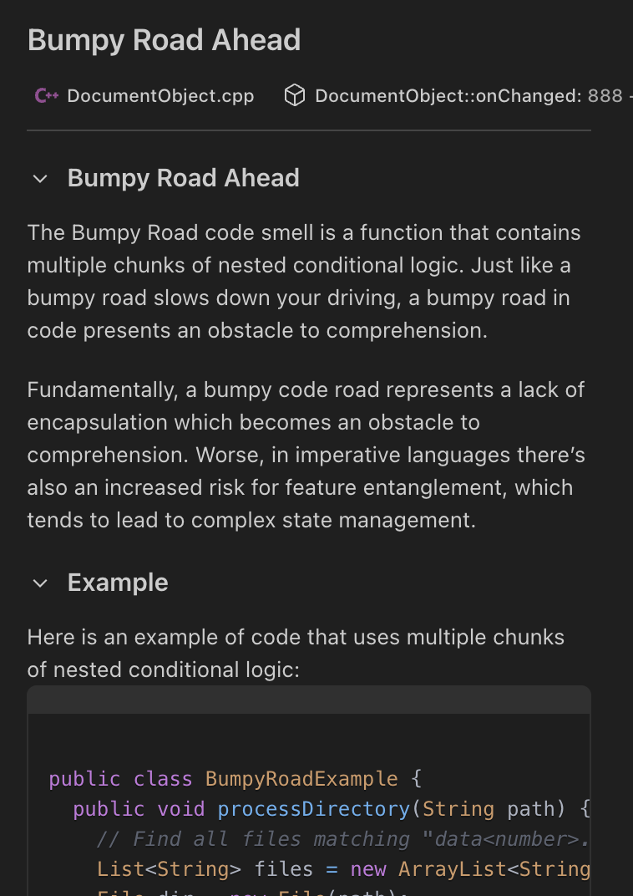
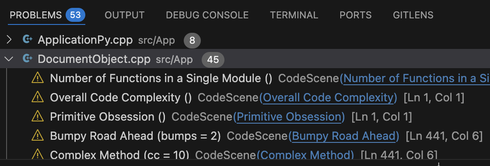
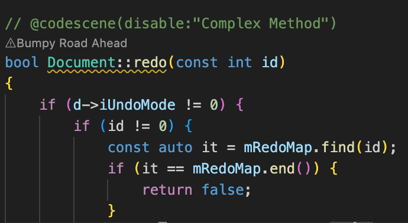

# CodeScene - Code Analysis
[](https://codescene.io/projects/36131)

> Do not install this extension alongside CodeScene (`codescene.codescene-vscode`). Uninstall one before installing the other.

## What is CodeScene for Visual Studio Code? ##
[CodeScene](http://www.codescene.com) is the only code analysis tool with a **proven business impact**. It serves as a **safeguard** against introducing code changes that could negatively affect your business outcomes.

CodeScene promotes **healthy, maintainable code** by providing clear, actionable insights and guidance on how to improve your codebase.

By using CodeScene, developers can spend less time deciphering complex code, and more time focusing on what truly matters: **solving problems and delivering value**.

## The CodeScene CodeHealth™ metric ##
CodeScene’s [CodeHealth™](https://codescene.io/docs/guides/technical/code-health.html) metric is the software industry’s only code-level metric with proven business impact, measured through fact-based, winning research. It’s a metric that you can trust. The extension analyses and scores your code as you type, and adds diagnostic items that highlights any [code smells](#code-smells).
CodeScene supports [most popular languages](https://codescene.io/docs/usage/language-support.html#supported-programming-languages).

## Safeguarding your code changes ##
Instant feedback is vital for maintaining high-quality code during development. By analyzing code as it’s written, developers may identify issues immediately. This interactive feedback loop encourages better coding habits, speeds up learning, and reduces the need for extensive rework later. 

Continuous feedback fosters a sense of flow and confidence, as you instantly can see the impact of your changes on overall code health. In short, interactive monitoring turns code quality from a delayed review process into a **continuous, integrated part of writing code**, ensuring long-term maintainability and faster, safer development.

The **Code Health Monitor** flags for drops in code health in real time and offers instant recommendations to keep your code maintainable.



> **_NOTE:_** _The Code Health Monitor is currently available to all users for a limited time period. However, this capability will become accessible only to CodeScene customers in future_.

## Overview of Available Features ##
| Feature | Description | What it looks like |
|---------|-------------|--------------------|
| **Code Health Monitor*** | The Code Health Monitor continuously tracks changes in your code, highlighting any improvements or degradations you introduce. Each file displays both its previous and current Code Health score, along with a clear delta value showing the overall change. You can easily see the impact of your modifications at the file or function level, including the status of any associated Code Smells—whether you’ve introduced new ones or resolved existing issues. With this level of visibility, there’s no longer any excuse for allowing Code Health to decline in your codebase. |  |
| **Inline Code Smell detection** | Code smells often lead to issues such as increased technical debt, more bugs, and reduced overall quality of the software. You can find detailed information for each code smell by either clicking the corresponding inline action notation in the editor, by examining the diagnostics (squigglies or in the Problems view), or by using the Quick Fix action menu (light bulb).|  |
| **Refactoring Guidance** | Our mission is to educate and raise awareness about Code Health and its impact on your efficiency as a developer. The CodeScene extension equips you with rich insights into Code Smells and provides clear, actionable guidance on how to address issues that may exist in your codebase. We include relevant examples that illustrate the essence of Code Smells, along with common patterns and practical solutions to help you write cleaner, more maintainable code. |  |
| **Problems View** | When a file is opened in the editor, it is instantly scanned for existing Code Health issues. All discovered issues are then listed in the IDE Problems View. This way you instantly get an overview of all opportunities a file has for improvements. |  |
| **Custom Code Health rules** | To customize the code analysis you can either use local [Code Comment Directives](https://codescene.io/docs/guides/technical/code-health.html#disable-local-smells-via-code-comment-directives) or create a `code-health-rules.json` file which applies to the entire project. |  |

## Configuration ##

You can add configuration files to the git repository to customize and control behavior in the Extension. They should be located in a `.codescene` folder, at the repository root. In addition, we also have a Settings page for personalized configuration of the extension.

### code-health-rules.json ###

Location: `.codescene/code-health-rules.json`

You can find more documentation on its content [here](https://codescene.io/docs/guides/technical/code-health.html#customize-the-code-health-rules-via-json)

### config.json ###

Location: `.codescene/config.json`

Example configuration:
```json
{
  "baseline_branch": "develop"
}
```
| Property | Type | Default | Description |
|----------|------|---------|-------------|
| **baseline_branch** | String | origin/HEAD (default branch) | The name of the branch that the Code Health Monitor should compare against when running its delta analysis. If no origin/HEAD or config present, it will look for the nearest merge-base among common shared branches (main, master, develop etc)

### Settings ###

Location: `Code Health Monitor` > `Extension Settings`

| Property | Type | Default | Description |
|----------|------|---------|-------------|
| **Enable Review Code Lenses** | Boolean | true | Enables/Disables showing Code Health Score and Code Smells in the active documents |
| **Enable Telemetry** | Boolean | true | Enable/Disable collecting anonymized telemetry for tracking usage and feature engagement. |

### Debug logging ###

CodeScene follows Visual Studio Codes Log level. To enable debug logging, in the command `Developer: Set Log Level...` to debug

_* Available time-limited for non CodeScene customers._
