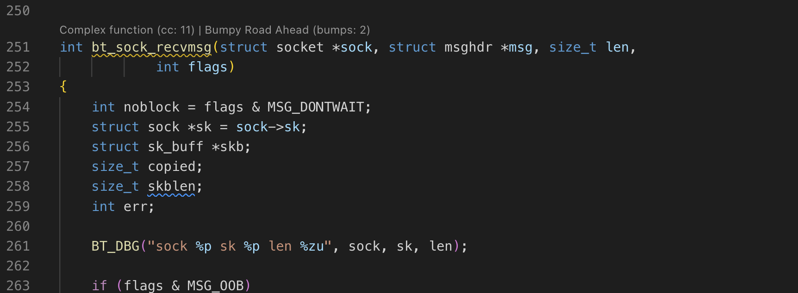
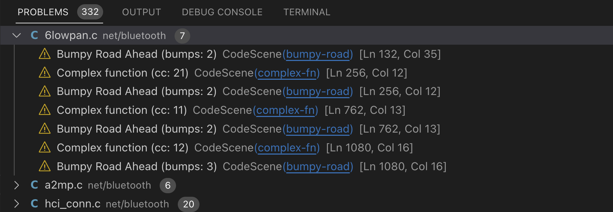
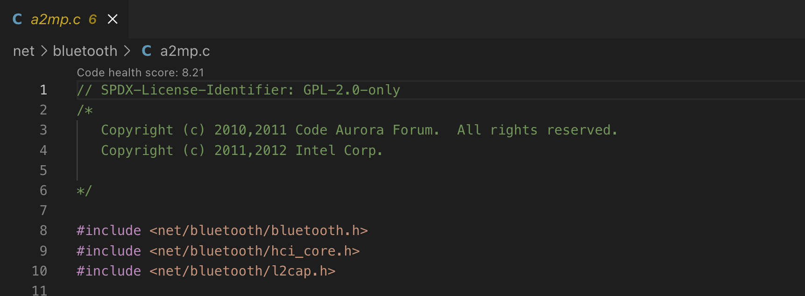

# CodeScene Coach

This extension brings a free, standalone version of CodeScene's code health analysis that shows you the results directly in your editor. It very likely supports your language. See the full list of supported languages below.

## Code Health
Code Health is an aggregated metric based on 25+ factors scanned from the source code. The code health factors correlate with increased maintenance costs and an increased risk for defects.

A healthy codebase enables a fast time-to-market with, on average, 124% faster development time. Healthy code also contains 15 times fewer defects than unhealthy code.

For further details on the business impact of code health, see the [Code Red research paper](https://arxiv.org/abs/2203.04374).

## Code Health Factors

Here are some examples of the factors that we measure:

- Nested complexity (highly nested if-statements or loops)
- Bumpy road (multiple chunks of nested complexity)
- Complex method, or high cyclomatic complexity
- Functions with too many arguments
- Functions that are too long

You can find more detailed information for each Code Health issue by drilling down in the editor.

You may also look at our main CodeScene [docs](https://codescene.io/docs/guides/technical/code-health.html) on code health for more info.

## Example screenshots

*Issues are displayed above the affected functions*

*Issues are registered as warnings and collected in the Problems tab*

*A score based on the CodeScene code health concept is shown at the top of the file*

## Language support

CodeScene supports most popular languages. Here is the full list:

- ✅ Apex (Salesforce)
- ✅ BrightScript
- ✅ C
- ✅ C#
- ✅ C++
- ✅ Clojure
- ✅ Dart2
- ✅ Elixir
- ✅ Erlang
- ✅ Go
- ✅ Groovy
- ✅ Java
- ✅ JavaScript
- ✅ Kotlin
- ✅ Objective-C 2.0
- ✅ PHP
- ✅ Perl 5
- ✅ PowerShell
- ✅ Python
- ✅ Rational Software Architect models (C++)
- ✅ React (jsx, tsx)
- ✅ Ruby
- ✅ Rust
- ✅ Scala
- ✅ Swift
- ✅ TCL
- ✅ TypeScript
- ✅ Visual Basic .Net
- ✅ Vue.js

## Features

- Diagnostics for functions with code health issues
- Optionally show code issues as code lenses for the affected function
- Customizable code health rules via `.codescene/code-health-rules.json` ([format description](https://codescene.io/docs/guides/technical/code-health.html#advanced-override-the-low-level-code-health-thresholds)). You can create a template with the command `codescene.createRulesTemplate`.

Note on custom code health rules: this is the same mechanism as the full CodeScene product.
Adding this file to your repo affects analyses by CodeScene as well.

## Extension Settings

This extension contributes the following settings:

- `codescene.enableCodeLenses`: Show code issues as code lenses.
