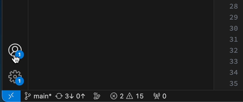

# CodeScene for VS Code

This extension allows you to use [CodeScene](http://www.codescene.com) - the only code analysis tool with a proven business impact - inside VS Code. It analyzes your code, and warns you if there are issues that make it more difficult to maintain.

### Key Features:

- **Live Analysis of Code Smells:** Receive real-time insights into potential issues and code smells as you code.
- **Code Smells Guide:** Explore explanations and solutions for identified code smells to level up your coding practices.
- **Custom Code Health rules:** Customize the Code Health rules to your preference.
- **Smart Improvement Suggestions:** Get actionable suggestions to enhance your code quality and development efficiency.
- **ACE:** Seamlessly improve your codebase with Auto-Refactoring powered by AI.

## Code Health
Aside from reporting individual issues, we also display a Code Health score of 1-10 for each file. Code Health is an aggregated metric based on 25+ factors scanned from the source code. The Code Health score correlates with maintenance costs and a risk for defects.

A healthy codebase, or high Code Health score, enables a fast time-to-market with, on average, 124% faster development time. Healthy code also contains 15 times fewer defects than unhealthy code.

For further details on the business impact of Code Health, see the [Code Red research paper](https://arxiv.org/abs/2203.04374).

### Language support
CodeScene supports [most popular languages](https://codescene.io/docs/usage/language-support.html#supported-programming-languages).

### Custom Code Health rules
To customize the code analysis you can either use local [Code Comment Directives](https://codescene.io/docs/guides/technical/code-health.html#disable-local-smells-via-code-comment-directives) or create a `.codescene/code-health-rules.json` file which applies to the entire project. You can create a rules file template with the CodeScene: Create Rules Template command. For more info, see the [format description](https://codescene.io/docs/guides/technical/code-health.html#advanced-override-the-low-level-code-health-thresholds) for `code-health-rules.json`.

Note: this is the same mechanism as the full CodeScene product, and adding it to your repo affects analyses on your CodeScene instance as well.

## Code Smells

Here are some examples of the factors that we measure:

- Nested complexity (highly nested if-statements or loops)
- Bumpy road (multiple chunks of nested complexity)
- Complex functions (measured as high cyclomatic complexity)
- Functions with too many arguments
- Functions that are too long

You can find more detailed information for each code smell by drilling down in the editor.

You may also look at our main CodeScene docs on [code health](https://codescene.io/docs/guides/technical/code-health.html) for more info.

##  Augmented Code Engineering (ACE) 
ACE is a Beta feature. If you want to try it out, please sign up to our waiting list [here](https://codescene.com/campaigns/ai)
CodeScene has always been great at identifying code smells and prioritizing them. With our AI-based Auto-refactor capability we make those insights actionable, too. Better: we also fact-check the AI code to ensure it produces the right snippet, saving you a lot of time and guaranteeing that your refactorings are both correct and impactful.

This feature extends CodeScene's capabilities to not only identify code health issues but also automatically suggest and perform code refactoring to improve the overall maintainability of your codebase. CodeScene's ACE is designed to enhance your development experience by proactively addressing issues in your code. By leveraging advanced analysis techniques with help of AI, it can help identify areas of improvement within your code and provide automated suggestions for refactoring.

To unleash the full potential of the AI features you need to sign in to a CodeScene instance. Clicking "Sign in with CodeScene..." will open an external browser for logging in to CodeScene, then redirect you back to vscode. Read more in the [docs](https://codescene.io/docs/auto-refactor/index.html).

