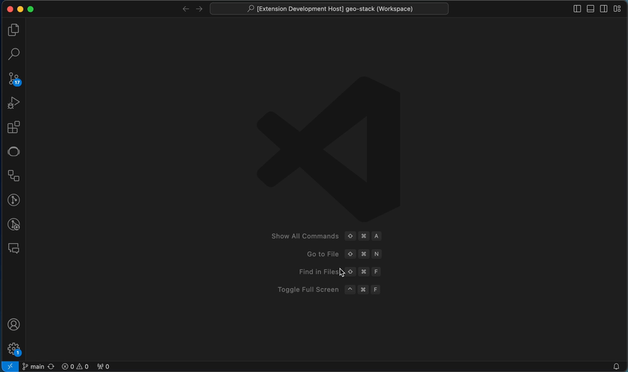

# CodeScene - Code Analysis

### Table of Contents
2. [Code Health Monitor ✨**New**✨](#code-health-monitor)
3. [Code Health Analysis](#code-health-analysis) 
4. [Code Smells Guide](#code-smells)

## Code Health Monitor
Track code health in real-time as you work. The Monitor highlights code smells and shows you opportunities where to improve your code.

## Code Health Analysis
CodeScene’s [Code Health](https://codescene.io/docs/guides/technical/code-health.html) metric is the software industry’s only code-level metric with proven business impact, measured through fact-based, winning research. It’s a metric that you can trust.

The extension analyses and scores your code as you type, and adds diagnostic items that highlights any [code smells](#code-smells).

### Language support
CodeScene supports [most popular languages](https://codescene.io/docs/usage/language-support.html#supported-programming-languages).

### Custom Code Health rules
To customize the code analysis you can either use local [Code Comment Directives](https://codescene.io/docs/guides/technical/code-health.html#disable-local-smells-via-code-comment-directives) or create a `code-health-rules.json` file which applies to the entire project.  

## Code Smells

Code smells often lead to issues such as increased technical debt, more bugs, and reduced overall quality of the software.

You can find detailed information for each code smell by either clicking the corresponding codelens in the editor, by examining the diagnostics (squigglies or in the Problems view), or by using the Quick Fix action menu (light bulb).

## Do you want to keep using CodeScene ACE?

CodeScene ACE, our AI-powered refactoring agent, was free during beta but will now be offered as an add-on to the extension.

If you’re interested in continuing to use CodeScene ACE or would like to share feedback, [reach out](https://codescene.com/contact-us-about-codescene-ace) to our Sales team.
